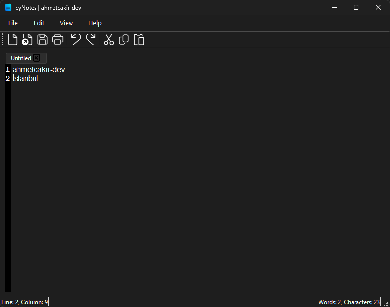

# pyNotes

pyNotes is a full-featured desktop note-taking application built with **Python** and **PyQt6**.  
It allows you to add, edit, delete, search, and categorize your notes with a clean and modern interface.



---

## ✨ Features
- Add, edit, and delete notes  
- List notes with timestamps  
- Search notes by title or content  
- Organize notes into simple categories (optional)  
- Lightweight and easy to use  

---

## 🚀 Installation

1. Clone this repository:
   ```bash
   git clone https://github.com/ahmetcakir-dev/pyNotes.git
   cd pyNotes
   ```

2. İnstall dependencies:
   ```bash
   pip install -r requirements.txt
   ```

3. Run the application:
   ```bash
   py pyNotes.py
   ```

---

## 🛠️ Tech Stack
- Python  
- PyQt6    

---

## 📜 License
This project is licensed under the MIT License.

---

## 👤 Author
[ahmetcakir-dev](https://github.com/ahmetcakir-dev)
